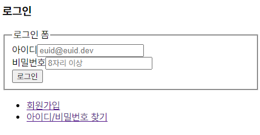
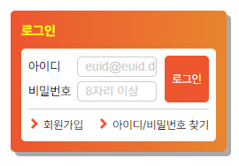

# **position 과제**

## **마크업 순서**

1. 로그인(제목)
2. 아이디 레이블과 입력서식
3. 비밀번호 레이블과 입력서식
4. 로그인 버튼
5. 회원가입 및 아이디/비밀번호 찾기 링크

## **Result**

### **마크업 구조**



### **완성 (스타일적용)**



## Description

### Markup

- `.login-wrap` 클래스를 가진 `<div>`안에 전체 요소를 감싸줌.
  - 하위 요소에 `<header>`와 `<main>`으로 구분.
- `<header>` 안에는 `<h3>` 태그로 제목 지정.
- `<main>` 안에 `<form>`영역과 `'회원가입, 아이디/비밀번호 찾기'` 영역 배치.
- `<form>` 영역 내에 `<fieldset>`지정, `<legend>` 작성 후 CSS를 통한 숨김처리.

```css
.a11y {
  position: absolute;
  width: 1px;
  height: 1px;
  margin: -1px;
  overflow: hidden;
  visibility: hidden;
  clip: rect(0, 0, 0, 0);
  clip-path: inset(50%);
}
```

- 아이디와 비밀번호 입력을 위한 구역으로 각각 `<label>`과 `<input>` 요소를 담은 `<div`>과 `<button>` 생성.
- `<form>` 영역 바깥에 `'회원가입, 아이디/비밀번호 찾기'`를 `<ul>`요소 안 `<li>`로 배치.
- 링크 기능을 위해 `<li>` 요소 안에 `<a>` 사용.

### CSS

- 로그인 버튼의 배치를 위해 `position: absolute` 속성 사용.
  - 상위 요소인 `<main>` 요소에 `position: relative` 적용.
- 회원가입, 아이디/비밀번호 찾기 영역 배치를 위해 `<ul>` 요소에 `display: flow-root` 값을 준 후 자식 요소인 `<li>`에 각각 `float: left`, `float: right` 적용.
