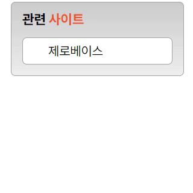

# **transition 과제**

## **Result**

## Description

### Markup

- `.container 
`안에 전체 요소 포함
- `<h3>` + `<ul>` > `<li> > <a>` 로 구성

### CSS

- `.container`에 width와 padding 지정하여 크기 적용
- `<h3>` 안 주황색 텍스트 `.highlight `을 통한 별도 color 지정
- `<ul>` 요소 안 list의 기본 스타일 제거, `height` 속성을 통한 기본 높이 지정, `overflow: hidden` 속성을 통해 넘침 콘텐츠 보지이 않도록 설정
- `<a>` 요소에 `display: block`과 `padding-left` 속성을 활용한 마우스 클릭 범위 확장
- `<ul>`에 마우스에 올렸을 때 커지도록 `height` 지정, 내부 list가 살짝 아래로 움직이는 효과를 위해 상하 `padding`값 추가
- 부드러운 움직임 처리를 위해 `transition`속성을 활용.
  - `height`속성은 **`duration`** 500ms, `padding`속성은 **`duration`** 500ms로 동일하지만 **`delay`** 를 500ms 만큼 추가해 늦게 동작하도록 처리
