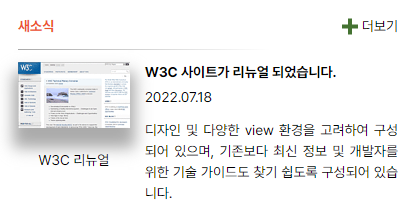

# **transition 과제**

## **Result**



## Description

### Markup

- `.news-container` 안에 전체 요소 포함
- 마크업 순서
  1. 뉴스 제목 (`.news-title`)
  2. 구분선 (`.line`)
  3. 뉴스 메인 영역 (`.news-main`)
  4. 이미지 영역 (`.news-image`)
  5. 더보기 링크 (`.more`)

### CSS

- `.news-conatiner`에 grid container 영역 지정

```CSS
  display: grid;
  gap: 12px 0;
  grid-template-columns: repeat(12, 1fr);
  grid-template-rows: auto;
  grid-template-areas:
    "title title . . . . . . . . more more"
    "line line line line line line line line . . . ."
    "image image image image main main main main main main main main ";
```
