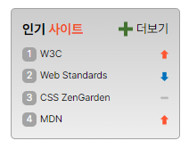

# **sprite 과제**

## **Result**



## Description

### Markup

- `.favorite` 섹션 안에 전체 요소 포함
- 마크업 순서
  1. 제목 (`.favorite-title`)
  2. 순위 영역 (`.favorite-rank`)
  3. 더보기 링크 (`.favorite-more`)
- `ol` 태그 안의 `li` 요소들에 각 랭크별 클래스 부여. (e.g. rank1, rank2 ...)
- **`sprite`** 기법 사용을 위해 클래스명 추가
  - sprite
    1. spriteUp
    2. spriteDown
    3. spriteStop

### CSS

- 순위 영역인 `.favorite-rank`에 `display: flex`를 활용하여 아이템 배치
  - `flex-flow: column nowrap`
  - flex item 사이의 간격 조절을 위해 `gap: 0.5rem` 지정
- `ol` 기본 스타일 제거 후 `::before` 가상 요소를 추가해 구현

```CSS
  .favorite-rank [class^="rank"]::before {
    display: inline-block;
    width: 1rem;
    height: 1rem;
    color: #fff;
    font-size: 0.6875rem;
    background: #a3a3a3;
    border-radius: 0.3125rem;
    text-align: center;
    margin-right: 0.25rem;
}

/* 각 순위별 숫자 추가 */
.rank1::before {
  content: "1";
}
.rank2::before {
  content: "2";
}
.rank3::before {
  content: "3";
}
.rank4::before {
  content: "4";
}
```

- **`sprite`** 기법을 활용하기 위한 이미지 지정

```CSS
.sprite {
  background: url(./rank.png) no-repeat;
}
```

- 각 순위 이미지별 포지션 지정
  - 영역 가장 오른쪽에 배치하기 위해 x 값에 100% 지정

```CSS
.spriteUp {
  background-position: 100% 3px;
}

.spriteDown {
  background-position: 100% -41px;
}

.spriteStop {
  background-position: 100% -19px;
}
```
